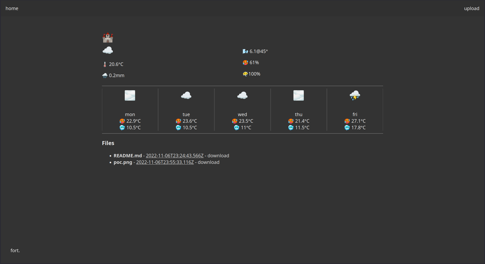
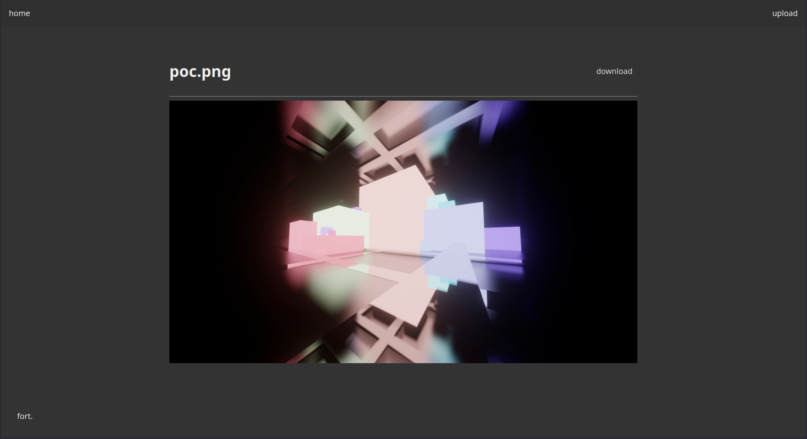
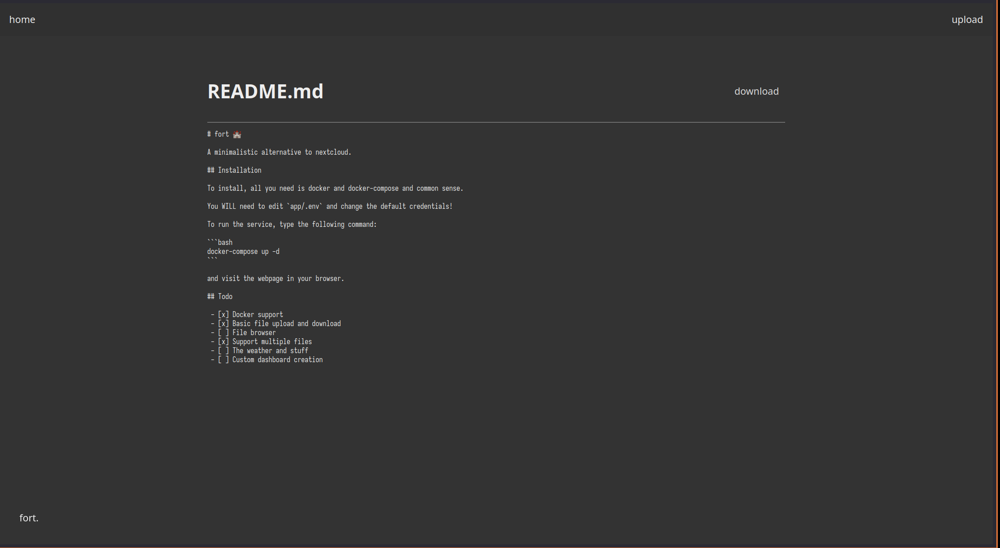
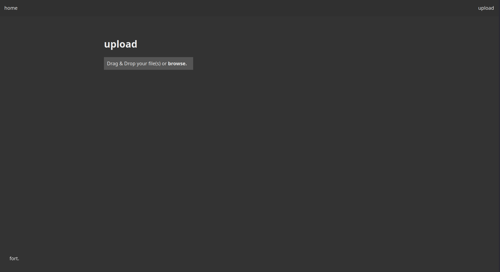
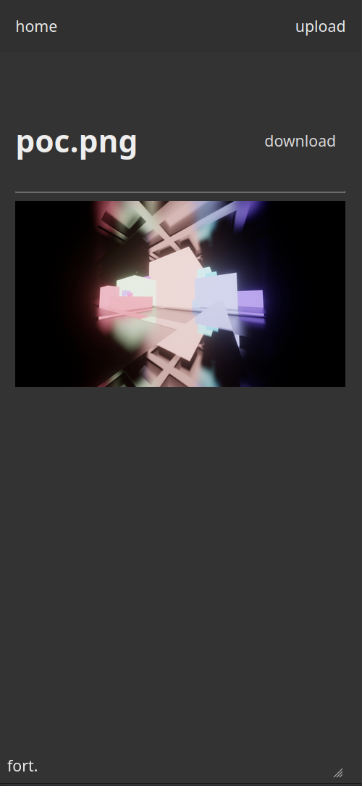

# fort 🏰

A minimalistic alternative to nextcloud.

## Screenshots







## Installation

To install, all you need is docker and docker-compose and common sense (please don't use the default credentials).

You WILL need to edit `docker-compose.yml` and change the default credentials (`ADMIN_LOGIN`). You may also want to change the storage location for persistent storage (`STORAGE_PATH`).

You'll also need to edit the `LAT` and `LON` environment variables if you want accurate weather info.

To run the service, type the following command:

```bash
docker-compose up -d
```

and visit the webpage in your browser.

## Todo

 - [x] Docker support
 - [x] Basic file upload and download
 - [x] No third-party cross-origin nonsense on client-side
 - [x] File browser
 - [ ] File editor
	 - [x] Create files
	 - [x] Create folders
	 - [x] Upload files to directory
	 - [x] Delete files
	 - [x] Rename files
	 - [ ] Rename folders
	 - [x] Edit text files
 - [ ] Layer 7 stuff
   - [x] HTTP/2 support
   - [ ] HTTP/3 support
   - [x] TLS support
 - [ ] Upload progress bar
 - [x] Support multiple files
 - [x] The weather and stuff
 - [ ] Custom dashboard creation
